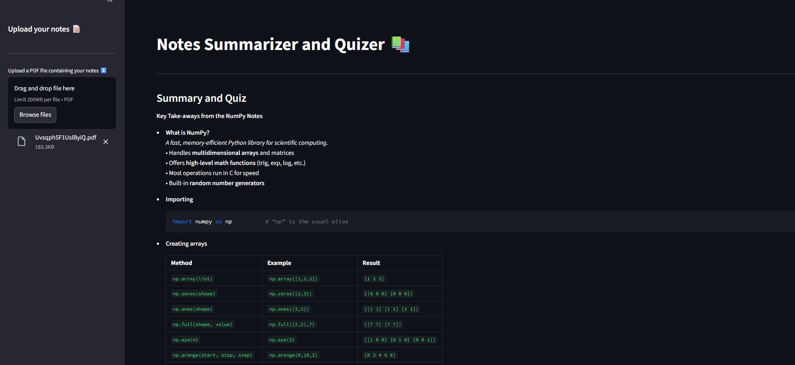

# 📚 AI Notes Summarizer & Quizer

An AI-powered Streamlit web app that takes your study notes (PDFs), generates a clear and concise summary, and creates quiz questions (MCQs) for revision. Built using Groq’s ultra-fast LLM inference and OpenAI OSS models, it’s designed to make studying more efficient and interactive.

---

## 🚀 Features

- 📝 Upload PDF Notes → Supports extracting text from your notes.

- ⚡ AI Summarization → Converts raw notes into structured bullet points.

- 🎯 Quiz Generator → Generates 3–5 MCQs for active recall practice.

- 📥 Download Option → Save your summary + quiz as a .txt file.

- 🎨 Simple Streamlit UI → Easy-to-use, clean, and responsive.

---

## ⚙️ Tech Stack

| Technology          | Purpose                                                |
|---------------------|--------------------------------------------------------|
| Python              | Core programming language                              |
| Streamlit           | Frontend Web App framework                             |
| Groq API (gpt-oss-20b)| LLM inference       |
| dotenv              | Securely manage API keys                               |
| os                  | For environment handling                               |

---

## 🚀 Getting Started

### 1. Clone the Repository

```bash
git clone https://github.com/KaisoX24/AI-Notes-Summarizer.git
cd ai-notes-summarizer
```
### 2. Install Dependencies
- It's recommended to use a virtual environment:

```bash
python -m venv venv
venv\Scripts\activate # For MAC: source venv/bin/activate
```
- Install the required packages:

```bash
pip install -r requirements.txt
```
### 3. Set Up .env
Create a .env file in the root directory and add your Groq API key:
```bash
GROQ_API_KEY=your_api_key_here
```

### 4. Run the App
```bash
streamlit run main.py
```
---

## 📸 UI Preview


---
## 🧑‍💻 Author
Developed by Pramit Acharjya
---
## 🪪 License
MIT License — free to use, modify, and distribute.
